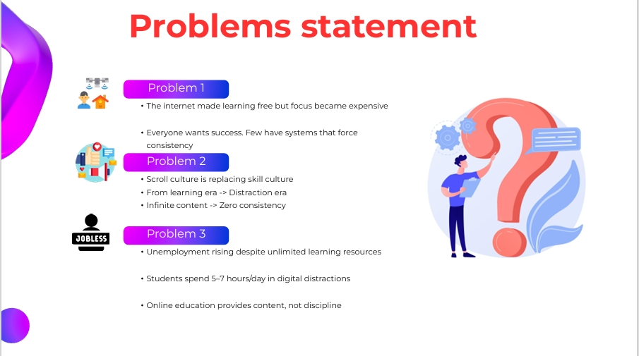
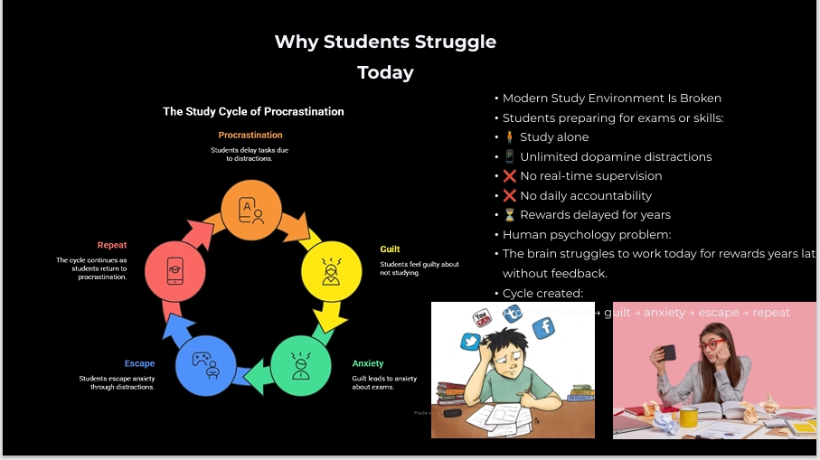
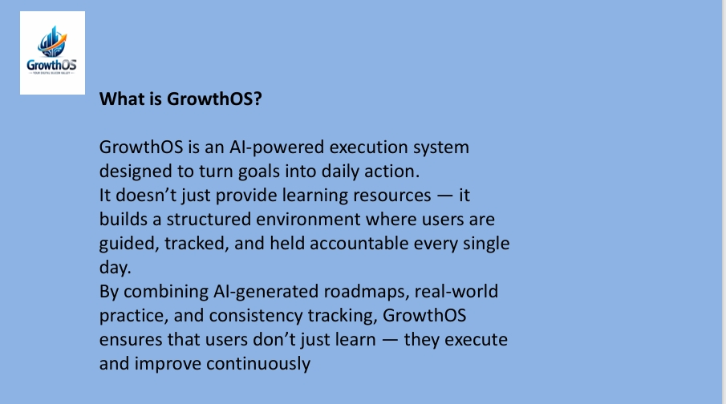
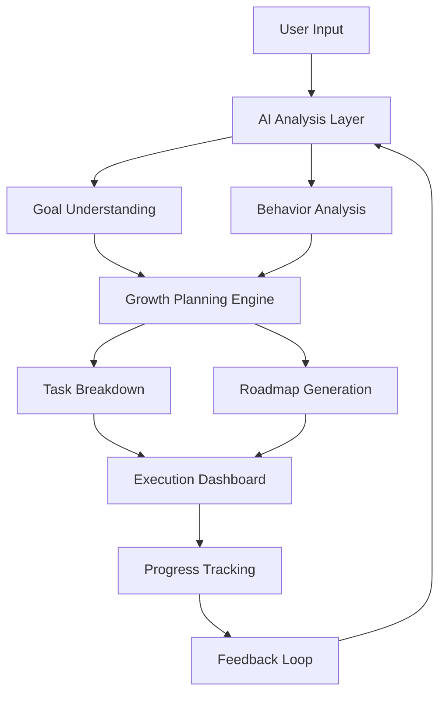

<h1 align="center"> GrowthOS</h1>

<p align="center">
  Your Digital Silicon Valley<br>
  This is not an app you open.
This is an environment you live in>
</p>

<p align="center">
  
</p>

---

<p align="center">
  
</p>

<p align="center">
  🔄 Initializing Intelligence Engine... <br/
  🔄 Designing Your Growth Roadmap... <br/>
  🔄 Activating AI Command Center..>
</p>

---


---

##  What is GrowthOS

> GrowthOS is not just an app.
> It’s a **complete AI-powered system** designed to help you think, plan, execute, and grow like a startup.

###  Core Idea:

GrowthOS is a focused digital environment designed to eliminate distractions and build consistency.
It transforms the internet from a place of consumption into a system of execution and growth.

Instead of learning endlessly, users enter a system where:

Actions are guided
Progress is tracked
Discipline becomes automatic
Human = Vision
AI = Execution Engine
GrowthOS = System that connects both

# Core Philosophy

Talent is common. Execution environments are rare.

As shown in real-world systems like Silicon Valley or competitive ecosystems:

People grow faster when they are observed
When they have deadlines
When they are accountable in real-time

👉 GrowthOS digitally recreates this environment

---
## Problem solving:-
 </td> <td align="center" width="50%">
<br>
 </td> <td align="center" width="50%">
-----

# What is GrowhtOs
 </td> </tr> </table>
## ⚙️ Features of the system

## 1. Practice Arena (The Heart of GrowthOS)

Not a learning section. A real execution battlefield.

Practice Arena is where users stop consuming and start performing.

 For Coders / Developers

A full coding ecosystem inspired by platforms like LeetCode & GFG — but inside a growth-driven system:

   **---→Problem Library**<br>
DSA (Easy → Hard)<br>
Real interview questions Company-specific sets

Built-in Code Editor + Compiler<br>
Write code directly in browser<br>
Run custom test cases<br>
Submit solutions instantly<br>
Multi-language support:<br>
C++<br>
Python<br>
Java<br>
 **---→Submission System<br>**
🟢 Pass / Fail results<br>
 Performance insights<br>
 Optimization suggestions (AI – future scope)<br>
🟢 365 Days Activity Graph<br>
GitHub / LeetCode-style heatmap<br>
Tracks daily consistency<br>

Legend:<br>

🟢 Green → Execution<br>
 Blank → Excuses<br>
🎓 For Students (All Streams)<br>

**---→Supports structured preparation for:<br>**

JEE<br>
NEET<br>
UPSC<br>
SSC<br>
School & College<br>
 **---→Exam Simulation Environment**<br>
⏱ Exam Mode<br>
30 questions per test<br>
Real exam-like pressure<br>
Time-based solving<br>
 Question Types<br>
MCQ (Objective)<br>
Numerical (Manual input)

**---→Subject formats:**

Physics → Numerical + MCQ
Chemistry → Theory + Calculation
Math → Step-based solving<br>
📅 Daily Action Plan (Execution Engine)

You never think “What should I do today?”

Auto-generated daily tasks
Personalized based on goals

**---→Includes:**

Practice problems


Study targets


Revision cycles


 This Eliminates


Overthinking


Decision fatigue


Procrastination


## **2. Execution Lab**
Deep work sessions


Focus mode (zero distractions)


Task completion tracking


Real-time progress monitoring


## 3. **Streak + Consistency Engine🔥**


Daily streak tracking
Visual growth graph
Momentum-based motivation

Miss a day → Break in streak → Visible loss

## 4. **Leaderboard System**

Multiple competitive layers:

🌍 Global Leaderboard


👥 Batch Leaderboard


📅 Daily Rankings


🎯 Skill-based Rankings


⚔️ Challenge System


## 5. Create challenges with friends
**Compare**:<brt>
Tasks completed


Accuracy


Consistency


Real-time performance tracking


## 6.**🔔Live Opportunities Engine**


Job & internship alerts


Exam notifications (SSC, UPSC, etc.)


Skill-based opportunities


Personalized recommendations


## 7.**👀 Accountability Layer (Core)**


Tracks every action


Monitors daily performance


Creates real pressure

## 8. AI Engine

GrowthOS uses AI for:

- Personalized growth roadmaps
- Smart task generation
- Weakness detection
- Consistency analysis
- AI mentor feedback
- Adaptive challenge difficulty

**You are always observed, measured, and pushed**

🔁 **System Loop**
Goal
 → AI Roadmap
 → Daily Tasks
 → Practice Arena
 → Execution Lab
 → Tracking
 → Leaderboard
 → Feedback
 → Repeat
 
Final Line

GrowthOS = No motivation. Only execution.
👉 This creates:

Consistency
Pressure
Progress
Identity shift
<table> <tr> <td align="center" width="50%">

Landing page

 </td> <td align="center" width="50%">
❄️Reality of Internet


 </td> </tr> <tr> <td align="center" width="50%">
📊 Execution Tracking

Visual progress system
Step-based growth indicators

 </td> <td align="center" width="50%">
Login and Sign up 

 </td> </tr> </table>


---


## 🧬 System Architecture


----
## 📁 Project Structure

```bash
GrowthOS/
├── app/
│   ├── auth/
│   ├── dashboard/
│   │   ├── challenges/
│   │   ├── community/
│   │   ├── growth-plan/
│   │   ├── leaderboard/
│   │   ├── practice/
│   │   └── settings/
│   │
│   ├── login/
│   ├── onboarding/
│   ├── pricing/
│   ├── signup/
│   ├── globals.css
│   ├── layout.tsx
│   └── page.tsx
│
├── Backend/
│   ├── db/
│   ├── models/
│   ├── routers/
│   │   ├── accountability.py
│   │   ├── activity.py
│   │   ├── auth.py
│   │   ├── dashboard.py
│   │   ├── growth_plan.py
│   │   ├── missions.py
│   │   ├── onboarding.py
│   │   ├── practice.py
│   │   ├── settings.py
│   │   ├── smart_tasks.py
│   │   └── streaks.py
│   │
│   ├── scheduler/
│   ├── schemas/
│   ├── services/
│   │   ├── accountability_service.py
│   │   ├── gemini_service.py
│   │   ├── growth_plan_ai.py
│   │   ├── practice_arena_service.py
│   │   ├── question_generator.py
│   │   ├── smart_task_service.py
│   │   └── streak_service.py
│   │
│   ├── auth.py
│   ├── config.py
│   ├── main.py
│   └── requirements.txt
│
├── components/
├── context/
├── lib/
├── public/
├── .env
├── package.json
├── tsconfig.json
├── next.config.ts
└── README.md
```

----

## 🛠 Tech Stack

| Category | Technologies |
|----------|---------------|
| Frontend | Next.js 14, React, TypeScript, Tailwind CSS, Framer Motion |
| Backend | FastAPI, Python |
| AI Engine | Open Routoer |
| Database |  PostgreSQL  |
| Authentication | JWT, OAuth  |
| Real-Time Features | WebSockets, Socket.io  |
| Code Execution | Judge0 API / Docker Sandbox * |
| Styling | Tailwind CSS, Lucide Icons |
| State Management | React Context API |
| Deployment | Vercel, Railway, Render |
| Version Control | Git & GitHub |
| Package Managers | npm, pip |
| APIs | REST API |
| Hosting | Vercel (Frontend)Render (Backend) |
| Future Integrations | Redis, LangChain, Pinecone, Supabase |


### Frontend (Next.js)


# 4. Run development server
npm run dev
# → http://localhost:3000
```

### Backend (FastAPI)

```bash
# 1. Navigate to backend
# used  Open Router API key for LLM usage 


# 3. Install dependencies
pip install -r requirements.txt

# 4. Start the API server
uvicorn main:app --reload --port 8000
# → http://localhost:8000
# → Swagger docs: http://localhost:8000/docs
```

##  Environment Variables


# Backend URL
NEXT_PUBLIC_API_URL=http://localhost:8000


## 📡 API Endpoints
```
| Method | Endpoint | Description |
|--------|----------|-------------|
| GET | `/` | Health check |
| GET | `/services` | List all services |
| POST | `/order` | Create new order |
| GET | `/orders` | List all orders (admin) |
| GET | `/projects` | List all projects |
| POST | `/contact` | Submit contact form |
```

-----
### Example Order Request:
```
POST /order
{
  "name": "John Doe",
  "email": "john@example.com",
  "phone": "+91 9876543210",
  "service": "AI Chatbot",
  "requirements": "I need a WhatsApp bot for my restaurant..."
}
```

## 🚢 Deployment

### Frontend → Vercel
```bash
npm install -g vercel
vercel --prod
```

### Backend →  Render
```bash
# Render.com
# Point to backend/ directory
# Start command: uvicorn main:app --host 0.0.0.0 --port $PORT
```

## 📱Info 
- **Email:** surinderkumar3182@gmail.com
- **Phone/WhatsApp:** +91 97974 86509
- **Location:** Punjab, India


## 📦 Packages Used
- `next` 14.2.3
- `framer-motion` 11.2.10
- `tailwindcss` 3.4.1
- `lucide-react` 0.383.0
- `fastapi` 0.111.0
- `uvicorn` 0.30.1

---------

# You don’t just learn. You don’t just work. You operate  a system.

