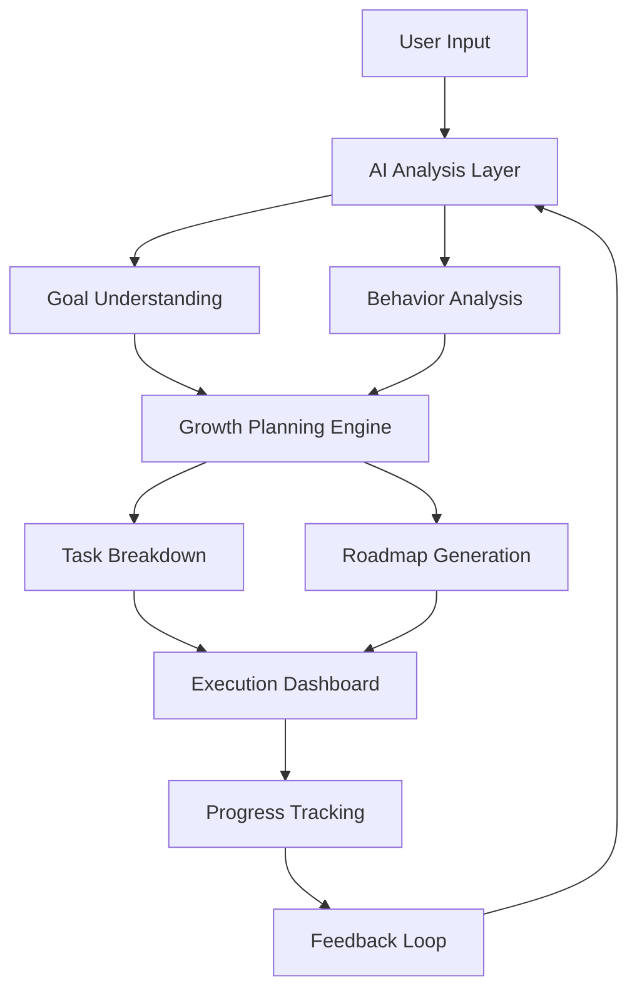

<h1 align="center">🚀 GrowthOS</h1>

  Your Digital sillicon valley
  https://media0.giphy.com/media/v1.Y2lkPTc5MGI3NjExb3M3ajBwZ3F4ZTY0aXBlc3pwMW5zbnhiYjM2a2w1ZjNmeHIxYnBmMiZlcD12MV9pbnRlcm5hbF9naWZfYnlfaWQmY3Q9Zw/dBZU8FAGD5R2gFWB2L/giphy.gif

---

  

  🔄 Initializing Intelligence Engine...  
  🔄 Designing Your Growth Roadmap...  
  🔄 Activating AI Command Center...

---

---

## 🧠 What is GrowthOS?

> GrowthOS is not just an app.  
> It’s a **complete AI-powered system** designed to help you think, plan, execute, and grow like a startup.

### 💡 Core Idea:

Human = Vision
AI = Execution Engine
GrowthOS = System that connects both

---

## ⚙️ Features
<table> <tr> <td align="center" width="50%">
🚀 AI Growth Engine

Generates roadmap for your goals
Breaks big vision into daily execution

 </td> <td align="center" width="50%">
❄️Reality of Internet

 </td> </tr> <tr> <td align="center" width="50%">
📊 Execution Tracking

Visual progress system
Step-based growth indicators

 </td> <td align="center" width="50%">
Login and Sign up 

 </td> </tr> </table>

---

## 🧬 System Architecture

----
# Build a system where:

You don’t just work
You operate like a company
| 🛠️ Tech  Stack |
| --------|-------|
|⚛️ React | Next.js|
🎨 CSS Animations
🧠 AI APIs (future scalable)
💡 System Design Thinking
📦 Installation
git clone https://github.com/yourusername/growthos
cd growthos
npm install
npm run dev
🧠 Philosophy

“People fail not because they lack motivation
but because they lack systems.”

GrowthOS = Your System.

🤝 Contribution

Pull requests are welcome.

⭐ Final Note

If this project inspires you, give it a ⭐
Let’s build the future of personal growth systems.

