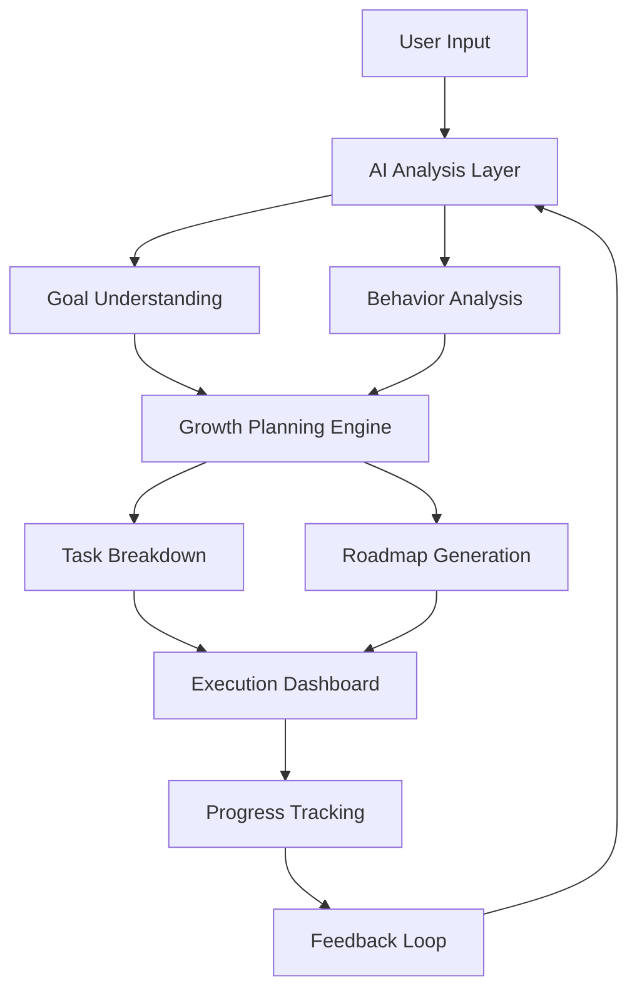

<h1 align="center">🚀 GrowthOS</h1>

  Your Digital Silicon Valley
  This is not an app you open.
This is an environment you live in.

  

---

  

  🔄 Initializing Intelligence Engine...  
  🔄 Designing Your Growth Roadmap...  
  🔄 Activating AI Command Center..>

---

---

## 🧠 What is GrowthOS?

> GrowthOS is not just an app.
> It’s a **complete AI-powered system** designed to help you think, plan, execute, and grow like a startup.

### 💡 Core Idea:

GrowthOS is a focused digital environment designed to eliminate distractions and build consistency.
It transforms the internet from a place of consumption into a system of execution and growth.

Instead of learning endlessly, users enter a system where:

Actions are guided
Progress is tracked
Discipline becomes automatic
Human = Vision
AI = Execution Engine
GrowthOS = System that connects both

# Core Philosophy

Talent is common. Execution environments are rare.

As shown in real-world systems like Silicon Valley or competitive ecosystems:

People grow faster when they are observed
When they have deadlines
When they are accountable in real-time

👉 GrowthOS digitally recreates this environment.

---
## Problem solving:-
 </td> <td align="center" width="50%">
 
 </td> <td align="center" width="50%">
-----

# What is GrowhtOs
 </td> </tr> </table>
## ⚙️ Features of the system

### Practice Arena (The Heart of GrowthOS)

Not a learning section. A real execution battlefield.

Practice Arena is where users stop consuming and start performing.

 For Coders / Developers

A full coding ecosystem inspired by platforms like LeetCode & GFG — but inside a growth-driven system:

🧠 Problem Library
DSA (Easy → Hard)
Real interview questions
Company-specific sets
⚡ Built-in Code Editor + Compiler
Write code directly
Run test cases
Submit solutions
Multi-language support (C++, Python, Java)
📊 Submission System
Pass/Fail results
Performance insights
Optimization suggestions (future AI)
🟢 365 Days Activity Graph
Like GitHub / LeetCode heatmap
Tracks daily consistency
Green = execution, Blank = excuses
📚 For Students (JEE / NEET / UPSC / SSC / School / College)

A structured exam simulation environment:

###  Exam Mode
30 questions per test
Real exam-like pressure
Time-based solving
🔢 Question Types
MCQ (objective-based)
Numerical (manual input)
Subject-specific formats:
Physics (numerical + MCQ)
Chemistry (theory + calculation)
Math (step-based solving)
📅 Daily Action Plan (Execution Engine)

You never think “what to do today”

Auto-generated daily tasks
Personalized per goal
Includes:
Practice problems
Study targets
Revision cycles

👉 This removes:

Overthinking
Decision fatigue
Procrastination
###  Execution Lab
Deep work sessions
Focus mode (no distractions)
Task completion tracking
Real-time progress

### Streak + Consistency Engine 🔥
Daily streak tracking
Visual growth graph
Momentum-based motivation

Miss a day → break in system → visible loss

### Leaderboard System

Multiple competitive layers:

🌍 Global Leaderboard
👥 Batch Leaderboard
📅 Daily Rankings
🎯 Skill-specific rankings

👉 Turns growth into competition + visibility

### Challenge System (Social Competition Layer)

Growth becomes competitive, not lonely

Create challenges with friends/batch
Compare:
Tasks completed
Accuracy
Consistency
Real-time comparison of performance

👉 You don’t just grow… you compete to grow faster

🔔 Live Opportunities Engine

Growth meets real-world outcomes

Job/internship alerts
Exam notifications (SSC, UPSC, etc.)
Skill-based opportunities
Personalized recommendations

👉 System connects:
Preparation → Opportunity → Action

### Accountability Layer (Most Important) 👀
Tracks every action
Monitors daily performance
Creates pressure like real environments

Like Silicon Valley / competitive ecosystems:
You are always observed, measured, pushed

🧩 How Everything Connects (System Thinking)

GrowthOS is not features — it’s a loop:

Goal → AI Roadmap → Daily Tasks → Practice Arena → 
Execution Lab → Tracking → Leaderboard → Feedback → Repeat

👉 This creates:

Consistency
Pressure
Progress
Identity shift
<table> <tr> <td align="center" width="50%">

Landing page

 </td> <td align="center" width="50%">
❄️Reality of Internet

 </td> </tr> <tr> <td align="center" width="50%">
📊 Execution Tracking

Visual progress system
Step-based growth indicators

 </td> <td align="center" width="50%">
Login and Sign up 

 </td> </tr> </table>

---

## 🧬 System Architecture

----
# You don’t just learn. You don’t just work. You operate like a company.

GrowthOS is an AI-powered execution system designed to eliminate distractions and turn goals into daily consistent action.

It’s not another productivity app.
It’s a behavioral operating system.

